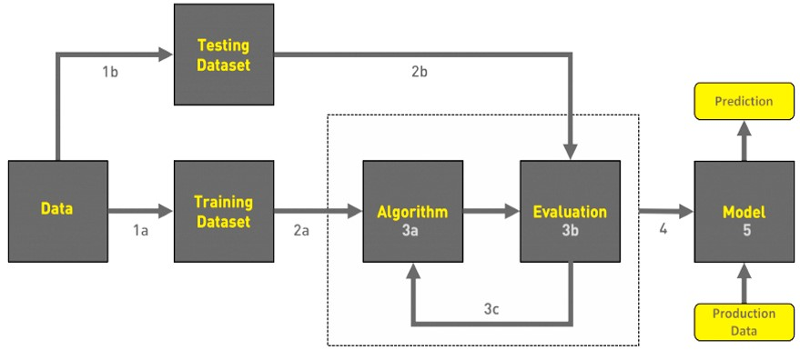

# Fire Detection Using Machine Learning Algorithms
𝗙𝗶𝗿𝗲 𝗗𝗲𝘁𝗲𝗰𝘁𝗶𝗼𝗻 using Machine Learning Algorithm with python, JupyterNoteBook & database taken from 𝗨𝗖𝗜 𝗠𝗮𝗰𝗵𝗶𝗻𝗲 𝗟𝗲𝗮𝗿𝗻𝗶𝗻𝗴 𝗥𝗲𝗽𝗼𝘀𝗶𝘁𝗼𝗿𝘆
## Dataset from UCI Machine Learning Repository
https://archive.ics.uci.edu/ml/datasets/Forest+Fires

---

### Introduction

In forests, fires can be started by humans or by natural causes. Naturally, fire occurs when there is an intense drought, high temperatures, lightning, or dry leaves and scobs that catch fire. Fires are also caused by human activity, such as using carried fire or throwing cigarettes, particularly in forested areas.

+ As a result, human-caused fires are discovered before naturally occurring flames. When a region catches fire, a variety of factors come into play. The hot, dry weather serves as a stimulant for fire. Because a fire in any place causes the temperature to rise. So an increase in temperature is one of the things that can aid in fire detection occurrences.
+ However, we cannot rely solely on temperature to identify fire because the temperature in a place may rise owing to sunshine. So we can also check the concentration of CO and CO2 gasses in that area to detect a fire. However, CO and CO2 gasses can be produced when someone uses a cigarette in that area, resulting in a false alert, or false fire event detection.
+ To improve the accuracy of predicting fire incidents, we will employ multiple ML algorithms to determine whether there is a fire or not. We will also train and test the machine using bespoke input to determine whether or not there is a fire. We will also calculate the accuracy, recall, and precision of various machine learning algorithms. As a result, we can protect our environment, animals, and livelihoods from the harmful effects of forest fires.

---

### Proposed Approach
+ Dataset contains image and video data.
+ Image data contains test and train data in image format each having 3 class i.e., default, smoke, fire.
+ Test_default has 84 images, test_fire has 57 images, test_smoke has 30 images.
+ Train_default has 161 images, train_fire has 274 images, train_smoke has 258 images.
+ Video data contains test and train data in video format.
+ Test_video contains 3 videos.
+ Train_video contains 12 videos consisting of fire with smoke, only fire, only smoke, no fire videos.
+ 
---

### Project WorkFlow

